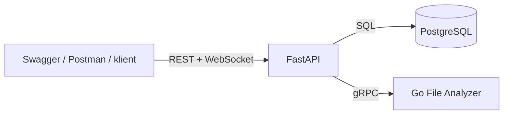

# JobForge

JobForge to backendowa platforma do tworzenia, przetwarzania i monitorowania zadan plikowych. FastAPI odpowiada za REST API, JWT, CRUD, pliki, WebSocket i statystyki. Serwis Go analizuje pliki przez gRPC. PostgreSQL przechowuje uzytkownikow, zadania, pliki i logi API.

## Funkcje

- rejestracja i logowanie z JWT;
- role `USER` i `ADMIN`;
- kontrola wlasciciela zadania;
- pelny CRUD `/jobs`;
- upload, download i usuwanie plikow `.txt`, `.csv`, `.json` do 1 MiB;
- analiza pliku przez Go i gRPC;
- wynik analizy: liczba bajtow, znakow, slow, linii i SHA-256;
- statusy `CREATED`, `RUNNING`, `COMPLETED`, `FAILED`;
- WebSocket `/ws/jobs/{job_id}?token=<JWT>`;
- logi wykorzystania API;
- statystyki uzytkownika i administratora;
- Docker Compose;
- Swagger, Postman, pytest, Go test i Locust.

## Architektura



### Odpowiedzialnosci

- `FastAPI` - REST API, JWT, CRUD, pliki, WebSocket, statystyki i klient gRPC;
- `Go Analyzer` - analiza pliku przez metode gRPC;
- `PostgreSQL` - tabele users, jobs, files i api_request_logs;
- `Docker Compose` - lokalne uruchomienie API, analizatora i bazy danych.

## Technologie

- Python 3.12
- FastAPI
- SQLAlchemy
- Alembic
- PostgreSQL 16
- JWT
- Go
- gRPC
- Docker Compose
- Swagger / OpenAPI
- Postman
- pytest
- Locust

## Uruchomienie lokalne w Dockerze

### Konfiguracja

```powershell
Copy-Item .env.example .env
```

W `.env` ustaw bezpieczne wartosci:

```env
JWT_SECRET=wygeneruj_dlugi_losowy_sekret
ADMIN_EMAIL=admin@jobforge.com
ADMIN_PASSWORD=ustaw_mocne_haslo
```

Nie publikuj `.env`, hasel, tokenow JWT ani prawdziwego `DATABASE_URL`.

Sekret JWT mozna wygenerowac poleceniem:

```powershell
python -c "import secrets; print(secrets.token_urlsafe(48))"
```

### Start

```powershell
docker compose up --build -d
```

### Sprawdzenie kontenerow

```powershell
docker compose ps
```

### Adresy lokalne

- Swagger: `http://localhost:8000/docs`
- Health API: `http://localhost:8000/health`

### Logi

```powershell
docker compose logs -f api analyzer db
```

### Zatrzymanie

```powershell
docker compose down
```

## Glowny scenariusz

1. Otworz `http://localhost:8000/docs`.
2. Wykonaj `POST /auth/register`.
3. Wykonaj `POST /auth/login`.
4. Skopiuj `access_token` i uzyj przycisku `Authorize`.
5. Utworz zadanie przez `POST /jobs`.
6. Zmien nazwe przez `PATCH /jobs/{job_id}`.
7. Wgraj plik przez `POST /jobs/{job_id}/file`.
8. Otworz WebSocket `/ws/jobs/{job_id}?token=<JWT>`.
9. Uruchom `POST /jobs/{job_id}/run`.
10. Sprawdz komunikaty `RUNNING` i `COMPLETED`.
11. Odczytaj wynik analizy.
12. Pobierz plik.
13. Sprawdz `/stats/me`.
14. Jako administrator sprawdz `/stats/admin`.

## Glowne endpointy

| Metoda | Endpoint | Dostep |
|---|---|---|
| POST | `/auth/register` | publiczny |
| POST | `/auth/login` | publiczny |
| GET | `/users/me` | JWT |
| POST | `/jobs` | JWT |
| GET | `/jobs` | JWT |
| GET | `/jobs/{job_id}` | wlasciciel |
| PATCH | `/jobs/{job_id}` | wlasciciel |
| DELETE | `/jobs/{job_id}` | wlasciciel |
| POST | `/jobs/{job_id}/file` | wlasciciel |
| GET | `/jobs/{job_id}/file` | wlasciciel |
| DELETE | `/jobs/{job_id}/file` | wlasciciel |
| POST | `/jobs/{job_id}/run` | wlasciciel |
| GET | `/stats/me` | JWT |
| GET | `/stats/admin` | ADMIN |
| WS | `/ws/jobs/{job_id}?token=...` | wlasciciel |
| GET | `/health` | publiczny |

## Testy automatyczne

### Python

```powershell
cd services\api-python
.\.venv\Scripts\Activate.ps1
python -m pytest -q
```

Ostatni wynik lokalny:


10 passed, 1 warning in 1.75s

### Go

```powershell
cd services\analyzer-go
go test ./...
```

Ostatni wynik lokalny:

ok github.com/sedittis/jobforge/services/analyzer-go/internal/analyzer

## Test kontrolowanej awarii Go

```powershell
docker compose stop analyzer
```

Uruchomienie zadania bez dostepnego analizatora konczy sie statusem `FAILED`, z `result: null` i zapisanym `error_message`.

Ponowne uruchomienie:

```powershell
docker compose start analyzer
```

Po przywroceniu uslugi nowe zadanie konczy sie jako `COMPLETED`.

## Postman

Pliki:

- `postman/JobForge.postman_collection.json`
- `postman/JobForge.local.postman_environment.json`

Kolekcja zapisuje `token` po logowaniu oraz `job_id` po utworzeniu zadania. Zawiera glowne endpointy REST i `GET /stats/admin`. Nie zawiera zapisanego hasla ani tokenu. Upload pliku wymaga recznego wskazania pliku lokalnego. WebSocket zostal sprawdzony recznie w Postmanie.

## Test wydajnosciowy

```powershell
python -m locust -f .\load-tests\locustfile.py --headless -u 10 -r 2 -t 1m --host http://localhost:8000 --csv .\load-tests\results\jobforge
```

Wyniki ostatniego testu lokalnego:

- 10 uzytkownikow;
- czas testu: 1 minuta;
- 478 requestow HTTP
- 0 bledow;
- 8.09 RPS;
- sredni czas odpowiedzi: 34 ms;
- mediana: 26 ms;
- p95: 89 ms;
- maksymalny czas odpowiedzi: 182 ms.

Szczegoly znajduja sie w `docs/performance.md`.

## Wyniki sprawdzonych scenariuszy

- rejestracja: dziala;
- logowanie i JWT: dziala;
- pelny CRUD: dziala;
- upload i download plikow: dziala;
- analiza gRPC: dziala;
- WebSocket: dziala;
- brak dostepu do cudzego zadania: dziala;
- USER dla `/stats/admin`: `403`;
- ADMIN dla `/stats/admin`: `200`;
- awaria Go: `FAILED`;
- powrot Go: `COMPLETED`;
- pytest: `10 passed`;
- Go test: `ok`;
- Locust: `478 requests`, `0 failures`.

Po wdrozeniu trzeba uzupelnic:

- URL publicznego API;
- URL Swaggera;
- URL health endpointu;
- konfiguracje zmiennych srodowiskowych;
- instrukcje wdrozenia.

## Repozytorium

Kod projektu znajduje sie w publicznym repozytorium:

https://github.com/SzymonPawlonka/jobforge

Repozytorium zawiera logiczna historie commitow oraz galaz `main`.

Po utworzeniu repozytorium uzupelnij:

```powershell
```

## Deployment

Publiczne API:

https://api-production-b70d.up.railway.app

Swagger:

https://api-production-b70d.up.railway.app/docs

Health:

https://api-production-b70d.up.railway.app/health

Deployment wykonano na Railway. FastAPI, PostgreSQL i Go Analyzer dzialaja jako osobne uslugi. API jest dostepne publicznie przez HTTPS.

## Swiadome ograniczenia

- brak frontendu;
- maksymalnie jeden plik na zadanie;
- pliki przechowywane sa w PostgreSQL;
- polaczenia WebSocket sa przechowywane w pamieci procesu;
- brak retry dla gRPC;
- brak refresh tokenow;
- brak OAuth;
- brak kolejki zadan;

