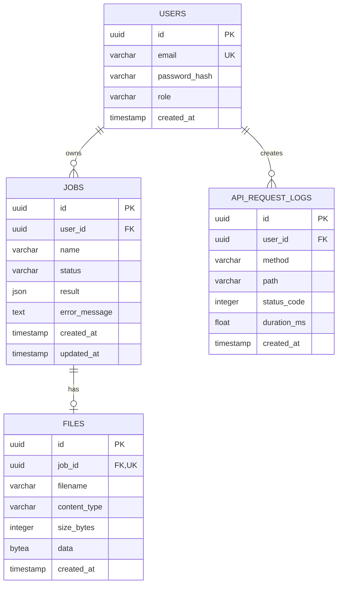

# Architektura

## Przepływ analizy

```text
POST /jobs/{id}/run
        |
        v
FastAPI: walidacja właściciela i pliku
        |
        v
status RUNNING + commit + WebSocket
        |
        v
Go gRPC AnalyzeFile(filename, content)
        |
        +---- sukces ----> result JSON + COMPLETED + WebSocket
        |
        +---- błąd ------> error_message + FAILED + WebSocket
```

## Model danych



## Decyzje techniczne

- SQLAlchemy używa typów przenośnych `Uuid`, `JSON` i `LargeBinary`, które poprawnie mapują się na PostgreSQL i pozwalają uruchamiać szybkie testy na SQLite.
- Logi API są zapisywane w oddzielnej sesji po zakończeniu odpowiedzi. Awaria mechanizmu logowania nie psuje odpowiedzi biznesowej.
- Token WebSocket jest przekazywany w query string, ponieważ przeglądarkowy API WebSocket nie pozwala swobodnie ustawiać nagłówka `Authorization`.
- Manager WebSocket działa w pamięci procesu. To poprawne dla jednej instancji demonstracyjnej, ale nie dla skalowania poziomego.
- Analiza gRPC ma timeout i nie wykonuje automatycznych retry, aby uniknąć ukrywania awarii podczas demonstracji.
